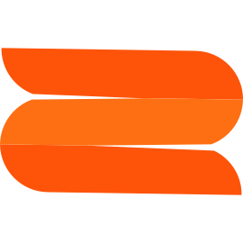

# Icon source

`sb-mark-square.svg` is the Second Brain mark padded to a square canvas — the
same file the website uses as its favicon. The PNGs in `public/icon/` are
rendered from it.

To regenerate (macOS, no ImageMagick needed):

```sh
# 1. Render a 1024px master with a transparent background
cat > /tmp/sb-icon-wrap.html <<'EOF'
<!doctype html><html><body style="margin:0;background:transparent">

</body></html>
EOF
cp icons/sb-mark-square.svg /tmp/
"/Applications/Google Chrome.app/Contents/MacOS/Google Chrome" \
  --headless=new --disable-gpu --hide-scrollbars \
  --default-background-color=00000000 --window-size=1024,1024 \
  --screenshot=/tmp/sb-icon-master.png /tmp/sb-icon-wrap.html

# 2. Downscale to the manifest sizes
for s in 128 48 16; do
  sips -z $s $s /tmp/sb-icon-master.png --out public/icon/$s.png
done
```
